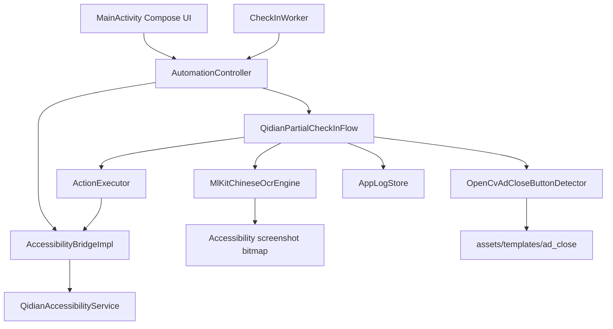

# QDReader.today 技术说明

本文档给开发者和 AI agent 快速接手使用。修改项目结构、依赖、自动化流程、识别策略、构建方式或隐私规则时，必须同步更新本文档和必要的 README 摘要。

## 项目定位

QDReader.today 是一个 Android APK 项目，用 Android 无障碍服务、离线中文 OCR、OpenCV 模板匹配和坐标手势，自动处理起点读书 App 的签到/福利任务。

- 本应用包名：`today.qdreader.auto`
- 目标应用包名：`com.qidian.QDReader`
- 目标最低系统：`minSdk = 30`
- UI：原生 Android + Kotlin + Jetpack Compose
- OCR：bundled ML Kit Chinese Text Recognition，离线运行
- 图像识别：OpenCV 模板匹配
- APK 构建：只通过 GitHub Actions，本地不构建 APK

## 仓库约束

- 不要提交 `AGENTS.md`，该文件只保存本地 agent 说明和设备连接信息。
- 不要提交 `脚本/`，里面是本地 UI 树样本、截图、调试脚本等。
- 不要提交 `artifacts/`、APK、AAB、构建产物或本地 SDK 配置。
- 不要把 ADB 地址、设备信息、账号信息写入 README、本文档或代码。
- 不要在本地运行 `assembleDebug`、`assembleRelease`、`bundle*` 或其他 APK/AAB 构建任务。
- GitHub Actions 生成的 APK artifact 默认由用户自行下载，agent 不下载。

## 目录和关键文件

- `README.md`：项目简介、构建方式和隐私规则摘要。
- `docs/TECHNICAL.md`：本文档，维护完整技术细节。
- `.github/workflows/android-debug-apk.yml`：Debug APK 远端构建 workflow。
- `app/src/main/AndroidManifest.xml`：应用权限、无障碍服务、目标包查询配置。
- `app/src/main/java/today/qdreader/auto/MainActivity.kt`：Compose 管理界面、权限入口、测试入口、手动自动化入口。
- `app/src/main/java/today/qdreader/auto/accessibility/`：无障碍服务和桥接能力。
- `app/src/main/java/today/qdreader/auto/automation/`：自动化控制器、动作执行器、签到/福利流程。
- `app/src/main/java/today/qdreader/auto/vision/`：OCR、模板匹配、广告关闭按钮识别。
- `app/src/main/assets/templates/ad_close/`：右上角广告关闭按钮模板。
- `app/src/main/java/today/qdreader/auto/schedule/`：每日调度和 Worker。
- `app/src/main/java/today/qdreader/auto/logs/`：应用内日志状态。

## 架构概览



## 管理界面

`MainActivity.kt` 是工具型面板，不是营销页。当前主要区域：

- 状态区：无障碍、通知权限、目标 App 安装状态。
- 权限区：打开无障碍设置、请求通知权限、打开起点读书。
- 测试区：截图 OCR 测试、OpenCV 模板匹配测试、手动运行自动化。
- 设置区：每日执行时间和是否启用。
- 日志区：最近运行日志，用于定位 OCR、截图、手势和广告关闭问题。

## 无障碍桥接

核心接口：`AccessibilityBridge`

能力：

- `readActiveWindow()`：读取当前窗口 UI 树。
- `captureScreenshot()`：通过无障碍截图获取 bitmap。
- `tap(point)`：坐标点击。
- `swipe(start, end, durationMillis)`：坐标滑动。
- `performBack()`：系统返回。
- `launchTargetApp()`：启动起点读书。
- `restartTargetApp()`：尽力关闭后台后重新启动起点读书。
- `launchAutomationApp()`：回到本自动化 App。

实现：`AccessibilityBridgeImpl` 通过 `QidianAccessibilityService` 操作系统能力。

注意：起点 App 部分页面是 H5、自绘或 TextureView 渲染层，不暴露 DOM、按钮或文字给 Android Accessibility。福利中心页主要依赖截图 OCR 和图像模板匹配。

## OCR

核心接口：`OcrEngine`

实现：`MlKitChineseOcrEngine`

- 使用 bundled ML Kit 中文文字识别。
- 离线运行，不依赖联网请求。
- 结果结构：`OcrResult(rawText, blocks, elapsedMillis)`。
- `blocks` 当前使用 ML Kit 的 line 级结果，坐标比 text block 更适合点击定位。

常用查询工具在 `OcrQueries.kt`：

- `hasText()` / `hasAnyText()`：判断 OCR 文本是否包含目标文字。
- `findTextCenter()` / `findAnyTextCenter()`：定位文字中心点。
- `findActionAfterAnyText()`：用多个任务锚点匹配同一行或相邻行的按钮状态。

OCR 文字会先做轻量归一化：去空白、`/`、`\`、`|`。目前没有做复杂纠错，任务识别通过别名列表容错。

## OpenCV 模板匹配

通用模板接口：`TemplateMatcher`

广告关闭按钮专用接口：`CloseButtonDetector`

实现：`OpenCvAdCloseButtonDetector`

- 模板目录：`app/src/main/assets/templates/ad_close/`
- 只在截图右上区域 ROI 内搜索，减少误匹配。
- 对 ROI 和模板做灰度 + Canny 边缘后执行 `matchTemplate`。
- 支持多个模板和多个缩放比例。
- 默认阈值：`0.68`。

如果某个广告关闭按钮识别失败，优先补充同尺寸或接近尺寸的 PNG 模板到 `assets/templates/ad_close/`，再调阈值或 ROI。

## 自动化入口

统一入口：`AutomationController.run(trigger)`

执行前检查：

- 无障碍服务已启用。
- 起点读书已安装。
- 无障碍服务已连接。

默认流程实例：

```kotlin
QidianPartialCheckInFlow(
    ocrEngine = MlKitChineseOcrEngine(),
    closeButtonDetector = OpenCvAdCloseButtonDetector(context)
)
```

动作执行统一走 `ActionExecutor`，目前支持：

- `NoOp`
- `TapPoint`
- `SwipePoints`
- `Back`

## 当前自动化流程

当前流程在 `QidianPartialCheckInFlow`。

1. 重新启动起点读书。
2. 通过 UI 树检查首页底部 4 个 tab：
   - `书架`
   - `精选`
   - `发现`
   - `我`
   - resource id：`com.qidian.QDReader:id/view_tab_title_title`
3. 点击底部 `我` tab。
4. 在我的页面检查登录状态：
   - 未登录标识：`登录/注册`，id `com.qidian.QDReader:id/tvLoginHint`
   - 未登录标识：`登录解锁更多精彩功能`，id `com.qidian.QDReader:id/newUserTag`
   - 未登录时回到本 App 并停止。
5. 点击 `福利中心`：
   - text：`福利中心`
   - id：`com.qidian.QDReader:id/tvTitle`
6. 福利中心页没有稳定 UI 树，通过 OCR 验证页面，必须识别：
   - `本周收益`
   - `积分商城`
   - `完成任务得奖励`
7. 福利中心页只上滑一次。不要在任务查找失败时重复上滑。
8. 在当前屏用 OCR 处理广告奖励任务。

当前配置的广告奖励任务：

- `激励任务`
  - OCR 锚点：`激励任务`、`激励`、`完成广告任务`、`多重好礼`
  - 最多执行轮数：5
- `完成3个广告任务得奖励`
  - OCR 锚点：`完成3个广告任务得奖励`、`完成3个广告`、`再完成3次`、`10点章节卡`
  - 最多执行轮数：5
- `完成1个广告任务得奖励`
  - OCR 锚点：`完成1个广告任务得奖励`、`完成1个广告`、`满10点`、`3点订阅券`
  - 最多执行轮数：3

任务状态按钮 OCR 别名：

- 去完成：`去完成`、`去完`、`去宪成`、`去完咸`
- 已完成：`已完成`、`已完`、`己完成`、`己完`

每个任务循环逻辑：

1. 当前屏 OCR 查找任务锚点右侧的 `去完成` 或 `已完成`。
2. 如果是 `已完成`，该任务结束。
3. 如果是 `去完成`，点击按钮。
4. 等 2 秒进入广告页。
5. 用 OpenCV 找右上角关闭按钮并点击。
6. 等待弹窗，OCR 查找 `点击去浏览` 或 `去浏览` 并点击。
7. 等 18 秒。
8. OCR 查找 `恭喜已获得奖励`、`恭喜获得奖励` 或 `恭喜获得`。
9. 系统返回到广告页。
10. 再次用 OpenCV 找右上角关闭按钮并点击。
11. OCR 查找奖励确认弹窗，若出现 `知道了` 和奖励文案，点击 `知道了`。
12. 回到福利中心当前屏，复查任务状态，直到 `已完成` 或达到最大轮数。

## OCR 失败诊断

当任务匹配失败时，流程会记录：

- 当前任务名。
- 锚点是否命中。
- 状态按钮是否命中。
- OCR 文本预览，最多取前 16 个 line，最多 220 个字符。

如果用户反馈“明明在屏幕上但找不到”，先看日志里的 `OCR 文本预览`：

- 如果锚点为 `false`：给该任务补充 OCR 别名。
- 如果状态为 `false`：给 `去完成` 或 `已完成` 补充 OCR 别名。
- 如果两者都是 `true` 但仍失败：检查坐标行距判断 `isLikelySameTaskRow()` 的纵向容差。
- 如果 OCR 文本预览为空：检查无障碍截图权限、页面是否被系统遮挡、截图是否黑屏。

## 调度

每日调度相关代码在 `schedule/`。

- `ScheduleConfig`：每日时间和启用状态。
- `SchedulePlanner`：安排每日任务。
- `CheckInWorker`：后台触发 `AutomationController.run(AutomationTrigger.Scheduled)`。

当前调度入口会调用同一套自动化流程。后续如果要区分手动和定时行为，在 `AutomationTrigger` 和 `AutomationController` 层扩展。

## 构建和发布

本项目不在本地构建 APK。Debug APK 只由 GitHub Actions 生成：

- Workflow：`.github/workflows/android-debug-apk.yml`
- 触发：`push` 或 `workflow_dispatch`
- 远端命令：`./gradlew --no-daemon assembleDebug`
- Artifact 名称：`QDReader.today-debug-apk`

本地允许做：

- `git status`
- `git diff --check`
- `rg` 静态搜索
- 敏感信息扫描
- workflow 文件检查

本地不要做：

- `./gradlew assembleDebug`
- `./gradlew assembleRelease`
- `./gradlew bundle*`
- 下载 GitHub APK artifact，除非用户明确要求。

## 扩展指南

新增福利任务：

1. 在 `QidianPartialCheckInFlow` 的 `WELFARE_AD_TASKS` 添加 `WelfareAdTask`。
2. 给 `matchTexts` 添加 OCR 容错锚点，不要只放完整标题。
3. 设置保守的 `maxRounds`，避免死循环。
4. 在真实设备日志中确认 OCR 文本预览。
5. 更新本文档的“当前自动化流程”。

新增广告关闭按钮模板：

1. 从真实广告页截图裁出关闭按钮。
2. 保存为 PNG 到 `app/src/main/assets/templates/ad_close/`。
3. 文件名要描述样式，例如 `close_gray_circle_x_alt2.png`。
4. 更新本文档的 OpenCV 模板说明。

调整 OCR 匹配：

1. 优先增加别名，不要直接放宽所有匹配条件。
2. 如果需要改行距判断，只改 `OcrQueries.kt` 中的局部逻辑。
3. 保留失败日志，方便下一次调试。

调整流程：

1. 保持 `AutomationController` 只做入口检查和依赖装配。
2. 具体起点页面流程放在 `QidianPartialCheckInFlow`。
3. 原子动作放在 `ActionExecutor`。
4. 视觉识别逻辑放在 `vision/`。
5. 修改流程后同步更新 README 摘要和本文档。

## 已知限制

- H5/自绘页面没有 UI 树，OCR 和模板匹配可能受字体、主题、缩放、广告样式影响。
- OCR 对细字、低对比度、动效页面存在误识别，必须依赖日志持续补别名。
- 广告关闭按钮样式可能变化，需要补模板。
- 当前福利中心只上滑一次，这是用户要求。任务如果不在一次上滑后的当前屏，流程会失败并输出 OCR 预览。
- 当前没有 release 签名配置，只生成 Debug APK。

## 文档维护规则

每次做以下变更，必须同步更新本文档：

- 自动化步骤、任务列表、等待时间、最大轮数。
- OCR 锚点、按钮别名、失败诊断策略。
- OpenCV 模板目录、阈值、ROI、匹配算法。
- 无障碍桥接接口或动作模型。
- 调度、通知、权限、构建流程。
- 隐私和 Git 忽略规则。

README 只放项目简介和使用入口；具体技术细节放在本文档。
